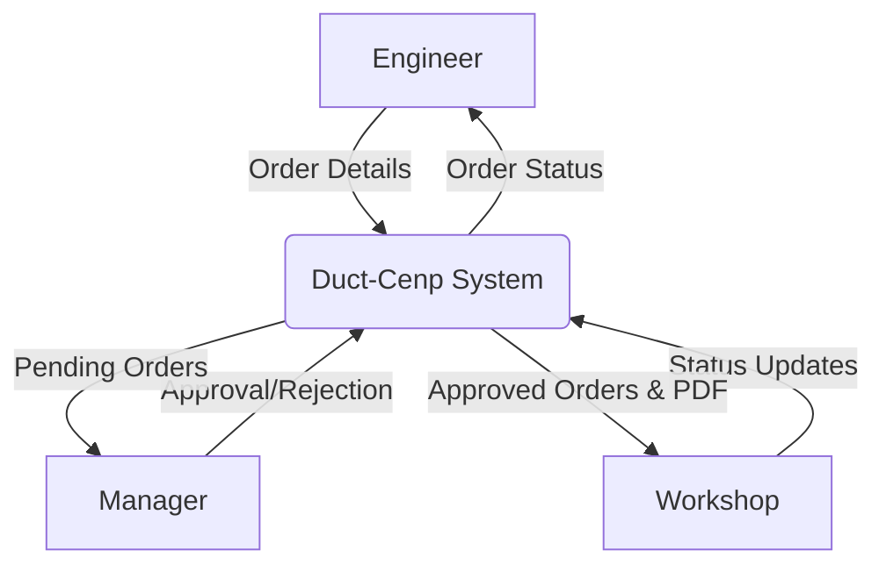
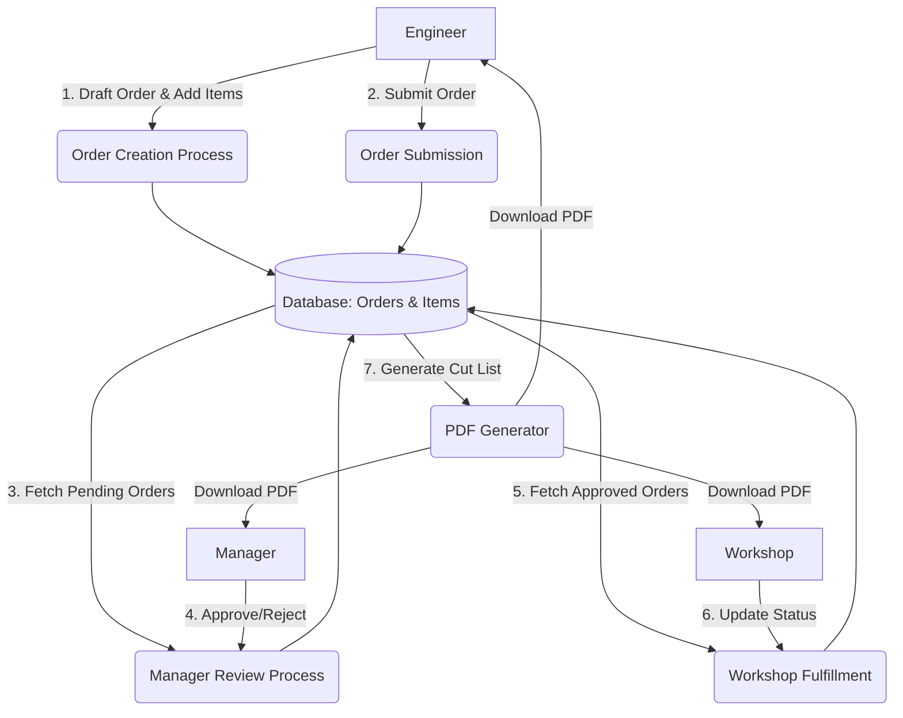

# Data Flow Diagram (DFD)

This document contains the Data Flow Diagrams representing the flow of information in the Duct-Cenp System.

## Level 0 DFD (Context Diagram)
The Context Diagram shows the system as a single process interacting with external entities (Users).

## Level 1 DFD
This level breaks down the main system into detailed sub-processes.

## DFD Process Descriptions
- **1. Order Creation Process:** Validates and stores the draft order and its line items.
- **2. Order Submission:** Changes the status of the order from 'draft' to 'submitted'.
- **3. Manager Review Process:** Displays orders awaiting approval to managers and processes their modifications/decisions.
- **4. Workshop Fulfillment:** Allows workshop staff to track their manufacturing pipeline and update order statuses.
- **5. PDF Generator:** Queries the order and items, groups them by duct type, and renders a PDF cut-list.
