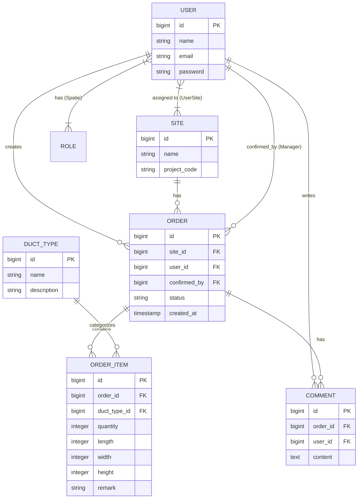

# Entity Relationship Diagram (ERD)

This document visualizes the database schema and relationships between different entities in the Duct-Cenp Order Management System.

## ERD Diagram

## Entity Descriptions
- **USER:** Represents the system users (Engineers, Managers, Workshop). Handled by Laravel Auth.
- **ROLE:** Represents user roles. Handled via Spatie Laravel Permission.
- **SITE:** Represents a construction or project site where ducts will be delivered/installed.
- **ORDER:** The main entity linking a site, the user who created it, and its current status.
- **ORDER_ITEM:** Details the specific duct pieces required for an order, including dimensions and quantities.
- **DUCT_TYPE:** A catalog of available duct shapes/types (e.g., Rectangular, Spiral).
- **COMMENT:** Communication logs attached to a specific order.
